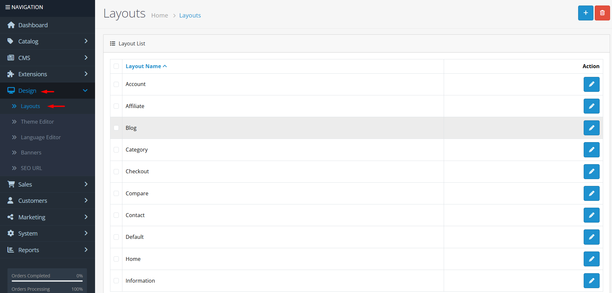
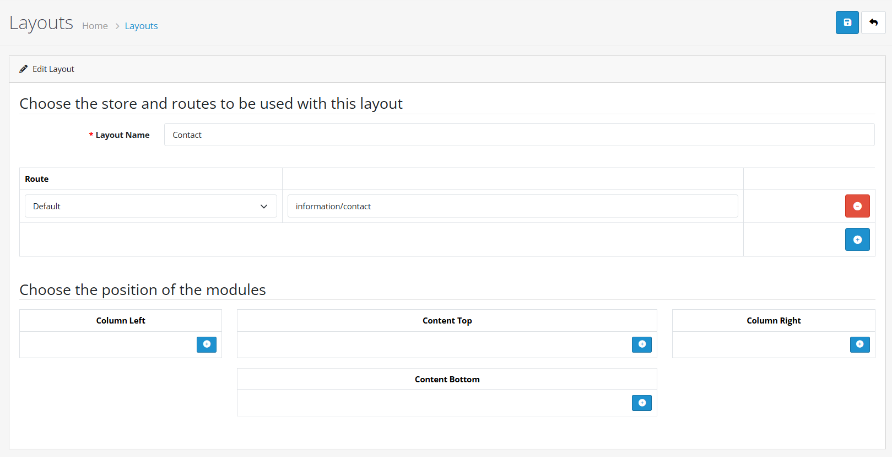
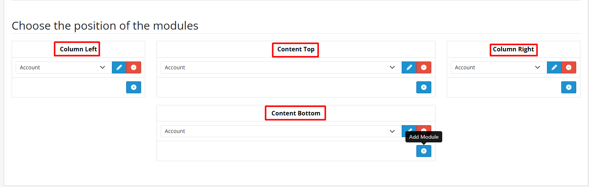

# Layouts

Layouts in OpenCart 4 give you complete control over the structure of your store's pages. Each layout defines which modules appear in specific positions (like sidebars, headers, or content areas) and which store routes (URL patterns) use that layout. This powerful feature allows you to create unique page designs for different types of content.

## Default Layouts

OpenCart 4 includes several pre-defined layouts for common page types:

| Layout Type      | Typical Routes            | Description                                    |
| ---------------- | ------------------------- | ---------------------------------------------- |
| **Default**      | `common/home`             | Home page and general fallback layout          |
| **Product**      | `product/product`         | Individual product pages                       |
| **Category**     | `product/category`        | Category listing pages                         |
| **Manufacturer** | `product/manufacturer`    | Brand/brand listing pages                      |
| **Information**  | `information/information` | Static content pages (About Us, Contact, etc.) |
| **Article**      | `cms/article`             | Blog/article pages (if CMS enabled)            |
| **Topic**        | `cms/topic`               | Blog topic pages (if CMS enabled)              |


**Tip:** You can modify the default layouts or create entirely new layouts to match your design needs. The Default layout cannot be deleted but can be modified.


### Accessing Layouts



**Log in to Admin Panel**

Open your browser and navigate to your OpenCart admin URL (typically `yourstore.com/admin`).

Enter your administrator credentials to log in.



**Navigate to Design → Layouts**

From the admin dashboard, go to the main menu and click **Design**, then select **Layouts** from the dropdown menu.

You can also use the quick search: type "Layouts" in the admin search bar.



**View Layouts List**

You'll see the layout management interface showing all existing layouts.

The list displays layout names, associated routes, and action buttons for editing or deleting.



### Creating a New Layout



**Step 1: Click Add New**

Click the **Add New** button (+) in the top-right corner of the layout list.



**Configure Layout Settings**

Fill in the layout configuration form:

**Layout Name**


**Layout Name Requirements** 📝

* **Required:** Yes
* **Length:** 3-64 characters
* **Purpose:** Internal name for admin reference
* **Example:** "Homepage Special Layout", "Product Detail Custom"


**Layout Routes**


**Route Configuration** ⚠️

* **Store:** Select which store this layout applies to (for multi-store setups)
* **Route:** Enter the URL route pattern (e.g., `product/product` for all product pages)
* **Multiple Routes:** You can add multiple route-store combinations to a single layout


**Module Positions**


**Positioning Modules** 🔢

* **Content Top:** Above main content area
* **Content Bottom:** Below main content area
* **Column Left:** Left sidebar
* **Column Right:** Right sidebar
* **Sort Order:** Controls display order within each position (lower numbers appear first)




**Save the Layout**

Click **Save** to create the new layout. You'll see a success message confirming the layout has been created.



### Editing an Existing Layout



**Locate the Layout**

From the layout list, find the layout you want to edit. You can use the search filter or browse through the list.

Click the **Edit** button (pencil icon) next to the layout name.



**Modify Layout Settings**

Make your changes in the layout form:

* **Layout Name:** Update the name if needed
* **Routes:** Add, remove, or modify route-store associations
* **Module Positions:** Reorder modules, add new modules, or remove existing ones

Use the same configuration guidelines as when creating a new layout.



**Save Changes**

Click **Save** to update the layout settings.

You'll see a success message confirming the layout has been updated.




**Note:** You cannot delete the Default layout if it's assigned as the default store layout. Other layouts can be deleted if they're not in use by products, categories, manufacturers, information pages, articles, or topics.


### Layout Configuration Details



**Define Layout Name**

The layout name is the internal identifier used in the admin panel. It should be descriptive and unique.

Click the **Layout Name** section below for detailed requirements.



**Configure Layout Routes**

Routes determine which store pages will use this layout. You can assign multiple route-store combinations.

Click the **Layout Routes** section below for route patterns and examples.



**Arrange Module Positions**

Modules are placed in specific positions on the page. Each position can contain multiple modules with sort order control.

Click the **Module Positions** section below for position descriptions and adding modules.



<strong>Layout Name</strong>

* **Required:** Yes
* **Length:** 3-64 characters
* **Purpose:** Internal reference name for administrators
* **Validation:** Must be unique and descriptive

<strong>Layout Routes</strong>

Routes determine which pages use this layout. Each route consists of:

| Setting   | Description                               | Examples                                                |
| --------- | ----------------------------------------- | ------------------------------------------------------- |
| **Store** | Which store this applies to (multi-store) | Default Store, Store 2                                  |
| **Route** | URL pattern that triggers this layout     | `product/product`, `information/contact`, `common/home` |

**Common Route Patterns:**

* `product/product` - All product pages
* `product/category` - All category pages
* `product/manufacturer` - All manufacturer pages
* `information/information` - All information pages
* `cms/article` - All article pages (CMS)
* `cms/topic` - All topic pages (CMS)
* `common/home` - Home page
* `account/*` - Customer account pages
* `checkout/*` - Checkout pages


**Route Matching:** OpenCart uses the most specific route match. If no specific route matches, it falls back to the Default layout.


<strong>Module Positions</strong>

Modules can be placed in four main positions:

| Position           | Location           | Typical Use                              |
| ------------------ | ------------------ | ---------------------------------------- |
| **Content Top**    | Above main content | Banners, featured products, promotions   |
| **Content Bottom** | Below main content | Related products, additional information |
| **Column Left**    | Left sidebar       | Categories, filters, navigation          |
| **Column Right**   | Right sidebar      | Cart, search, special offers             |

**Sort Order:** Within each position, modules are displayed in ascending sort order (0 appears before 1).

**Adding Modules:**

1. Select a module from the available modules list
2. Choose a position (Content Top, Content Bottom, Column Left, Column Right)
3. Set the sort order (0, 1, 2, etc.)
4. Click "Add Module" to add it to the layout

## Use Cases for Custom Layouts

<strong>1. Homepage Special Layout 🏠</strong>

Create a unique homepage with different module arrangements:

* **Route:** `common/home`
* **Modules:** Featured products in Content Top, latest products in Content Bottom, special offers in Column Right
* **Purpose:** Highlight promotions and new arrivals on the homepage

<strong>2. Product Page Enhancements 🛍️</strong>

Customize product pages with additional modules:

* **Route:** `product/product`
* **Modules:** Related products in Content Bottom, manufacturer info in Column Left, also bought in Column Right
* **Purpose:** Increase cross-selling and provide better product information

<strong>3. Category Page Optimization 📂</strong>

Improve category browsing experience:

* **Route:** `product/category`
* **Modules:** Category filters in Column Left, featured category products in Content Top, banner in Content Bottom
* **Purpose:** Help customers find products faster and promote category-specific offers

<strong>4. Checkout Process Simplification 🛒</strong>

Streamline the checkout process:

* **Route:** `checkout/*`
* **Modules:** Remove sidebars for full-width checkout, add trust badges in Content Bottom
* **Purpose:** Reduce distractions and increase conversion rates

## Practical Example: Creating a Homepage Special Layout

Let's walk through creating a custom homepage layout from start to finish.



**Plan Your Layout**

Before creating the layout, decide what modules you want on your homepage:

* **Content Top:** Featured products slider
* **Content Bottom:** Latest products grid
* **Column Right:** Special offers banner
* **Column Left:** Category navigation

Sketch the layout to visualize module placement.



**Create the Layout**

1. Go to **Design → Layouts**
2. Click **Add New**
3. Enter Layout Name: "Homepage Special"
4. Add Route: Store: "Default Store", Route: `common/home`
5. Click **Save** to create the empty layout



**Add Modules to Positions**

* **Content Top:** Select "Featured" module, set sort order 0
* **Content Bottom:** Select "Latest" module, set sort order 0
* **Column Right:** Select "Banner" module (configured with special offers), set sort order 0
* **Column Left:** Select "Category" module, set sort order 0

Click **Add Module** for each, then **Save** the layout.



**Test the Layout**

1. Visit your store homepage
2. Verify all modules appear in correct positions
3. Check mobile responsiveness
4. Test different screen sizes

Adjust sort orders or module settings if needed.




**Success:** You've created a custom homepage layout that highlights featured products, shows latest arrivals, and provides navigation—all optimized for conversion.


### Integration with Other Features

<strong>Multi-Store Support 🏪</strong>

Layouts support multi-store configurations:

1. Create different layouts for different stores
2. Assign layouts to specific stores via the route configuration
3. Each store can have completely different page structures

<strong>Module Management 🧩</strong>

Layouts work with all OpenCart modules:

1. Install and configure modules in **Extensions → Modules**
2. Add configured modules to layouts in **Design → Layouts**
3. Each module instance can be placed in different positions across different layouts

<strong>Template System Integration 🎨</strong>

Layouts complement the template system:

1. Templates control the visual design (HTML/CSS)
2. Layouts control the module placement and page structure
3. Together they provide complete design control

## Best Practices

### Layout Strategy 🎯

1. **Start Simple:** Begin with the default layouts and modify as needed
2. **Consistent Structure:** Use similar module arrangements across similar page types
3. **Mobile-Friendly:** Consider how layouts appear on mobile devices
4. **Performance:** Limit the number of modules per page for faster loading


**Route Management** ⚠️


5. **Specific First:** More specific routes should be configured before general ones
6. **Avoid Conflicts:** Ensure routes don't overlap unintentionally
7. **Test Thoroughly:** Check all route patterns work as expected
8. **Document Routes:** Keep a list of custom routes for future reference


**Module Placement** 🛠️


9. **Logical Order:** Place modules in logical reading order (top to bottom, left to right)
10. **Visual Hierarchy:** Important modules should have higher visibility
11. **Balance:** Distribute modules evenly across positions
12. **Empty Positions:** Leave empty positions if not needed (they won't display)

## Troubleshooting

### Common Issues

<strong>Layout not applying to pages 🔍</strong>

**Possible Causes:**

* Route pattern doesn't match the page URL
* Another layout has a more specific route match
* Layout is not assigned to the correct store

**Solution:** Check the route configuration and ensure it matches the page's route exactly.

<strong>Cannot delete layout 🗑️</strong>

**Possible Causes:**

* Layout is assigned as the default store layout
* Products, categories, or other entities are using the layout
* Permission restrictions

**Solution:**

1. Check if layout is the default in **System → Settings → Store**
2. Reassign entities to other layouts first
3. Verify user has permission to delete layouts

<strong>Modules not appearing 📦</strong>

**Possible Causes:**

* Module is disabled
* Module is not added to the layout
* Module position doesn't exist in the template
* Sort order conflict

**Solution:**

1. Check module status in **Extensions → Modules**
2. Verify module is added to the layout in correct position
3. Check template supports the position
4. Adjust sort order if modules overlap

<strong>Layout conflicts between stores 🏪</strong>

**Possible Causes:**

* Route-store combinations overlap
* Default layout conflicts with store-specific layouts

**Solution:** Review all route assignments and ensure each store-route combination is unique.


**Performance Considerations** ⚡

* Each additional module on a page increases load time
* Complex layouts with many route checks can slow down page routing
* Consider caching strategies for frequently accessed layouts
* Regularly review and remove unused layouts



**Documentation Summary** 📋

You've now learned how to:

* Create and manage layouts in OpenCart 4
* Configure layout routes and module positions
* Use layouts for different page types and stores
* Integrate layouts with modules and templates
* Apply best practices for layout management

**Next Steps:**

* [Banners](banners.md) - Create promotional banners for your layouts
* [SEO URL](seo-url.md) - Configure search-engine-friendly URLs for your pages
* [Modules](/broken/pages/Y7KlaNGfxLPbM6i0hLVh) - Learn about available modules for your layouts
* [Themes](/broken/pages/GEvVpjuecAWj7a4wOXIo) - Customize the visual design of your store


