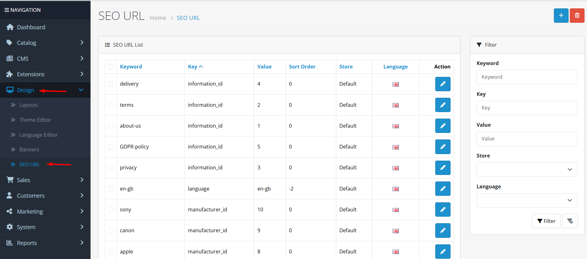
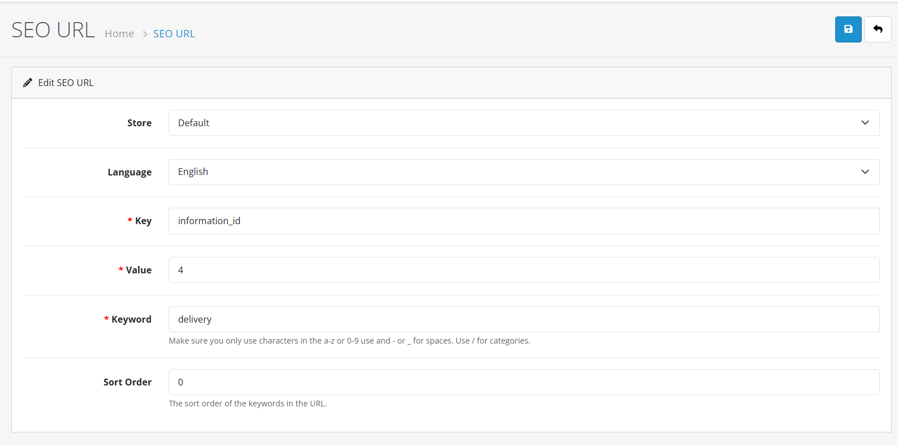

# SEO URL

## Video Tutorial



_Video: Managing SEO URLs in OpenCart 4_

## Introduction

SEO URLs in OpenCart 4 allow you to create clean, readable URLs that improve search engine rankings and user experience. Instead of complex URLs with multiple parameters, you can use keyword-based URLs that are easier for both customers and search engines to understand.

## SEO URL List

The SEO URL list displays all the URL aliases currently configured in your store. From here, you can:

* **Add New**: Create a new SEO URL mapping
* **Edit**: Modify existing mappings
* **Delete**: Remove SEO URL mappings
* **Filter**: Search for specific mappings by keyword, route, or language


**Pro Tip**: Use the filter feature to quickly find specific URL mappings when managing a large number of aliases across different stores and languages.


## Enabling SEO URLs

Before custom SEO URLs will work on your storefront, you must enable the feature in your system settings.



#### Access Store Settings

1. Log in to your OpenCart admin panel.
2. Navigate to **System → Settings**.
3. Click the **Edit** button next to your store.



#### Enable SEO URLs

1. Go to the **Server** tab.
2. Find the **Use SEO URL** option.
3. Set it to **Yes**.
4. Click **Save**.



#### Configure Server Rewriting

Depending on your server, you may need to:

* **Apache**: Rename `htaccess.txt` to `.htaccess` in your root directory and ensure `mod_rewrite` is enabled.
* **Nginx**: Add specific rewrite rules to your server configuration block.
* **IIS**: Install the URL Rewrite module and configure `web.config`.


**Server Configuration Required** ⚠️ SEO URLs require proper server rewrite configuration. Without it, your friendly URLs will return 404 "Not Found" errors.




## Creating/Editing SEO URLs

When you create or edit an SEO URL mapping, you will fill out a form with the following fields:

### Mapping Configuration

* **Store**: Select which store this mapping applies to (for multi-store setups).
* **Language**: Select which language this keyword is for (for multi-language setups).
* **Key**: The URL query parameter key (e.g., `route`, `product_id`, `category_id`).
* **Value**: The value for the key (e.g., `product/product`, `42`, `20`).
* **Keyword**: The friendly URL alias you want to use (e.g., `iphone-15`).
* **Sort Order**: Controls priority if multiple keywords match the same route.


**Key & Value Pairs**: For a typical product page, you would have two entries:

1. Key: `route`, Value: `product/product`
2. Key: `product_id`, Value: `42`



**Keyword Guidelines**: Use only lowercase characters (a-z), numbers (0-9), and hyphens (-) or underscores (\_). Use a forward slash (/) for nested paths like `electronics/phones`.


## Best Practices

<strong>URL Structure &#x26; Strategy</strong>

**SEO URL Guidelines**

**Structure Guidelines:**

* **Keep it Simple**: Short, descriptive URLs perform better.
* **Use Keywords**: Include relevant keywords naturally in the URL.
* **Hyphens over Underscores**: Search engines prefer hyphens as word separators.
* **Consistency**: Use lowercase consistently to avoid case-sensitivity issues on some servers.

**Optimization:**

* **Avoid Parameters**: Keep URLs clean without unnecessary query parameters.
* **Hierarchy**: Use forward slashes to indicate category depth (e.g., `/clothing/men/shirts`).
* **Breadcrumb Alignment**: Try to make URLs reflect the site's logical structure.


**SEO Tip**: A well-structured URL like `/electronics/laptops/macbook-pro` is much better for SEO than `/index.php?route=product/product&path=20_27&product_id=45`.


<strong>Multi-Store &#x26; Multi-Language</strong>

**Internationalization Best Practices**

**Localization:**

* **Localized Keywords**: Create keywords in the local language for each active language (e.g., `/about-us` vs `/sobre-nosotros`).
* **Store Specificity**: If you have different branding for different stores, use store-specific keywords.
* **Consistency**: Maintain a similar URL structure across languages where possible.


**Hreflang Support**: OpenCart automatically handles the technical SEO aspects of multi-language URLs, but you must provide the localized keywords.


## Common Tasks



#### Creating a Custom Alias for a Page

1. Navigate to **Design → SEO URL**.
2. Click **Add New**.
3. Select the **Store** and **Language**.
4. Enter `route` for the **Key** and the page route (e.g., `information/contact`) for the **Value**.
5. Enter your desired **Keyword** (e.g., `contact-us`).
6. Click **Save**.



#### Fixing a 404 Error on SEO URLs

1. Verify "Use SEO URL" is set to "Yes" in System Settings.
2. Check that `.htaccess` exists and has the correct rewrite rules.
3. Ensure the keyword is unique and doesn't conflict with other mappings.
4. Clear the system cache.



## Warnings and Limitations


**Critical Warnings**

* **Keyword Uniqueness**: Keywords MUST be unique for each store/language combination.
* **Changing Keywords**: Changing an existing keyword will break old links. Set up 301 redirects if necessary.
* **Special Characters**: Avoid using spaces or special characters like `?`, `&`, or `%` in keywords.
* **Reserved Routes**: Do not use keywords that conflict with actual file names or directory names in your root folder.


## Troubleshooting

<strong>SEO URLs Not Working (404 Error)</strong>

**Problem: Friendly URLs return a 404 page**

**Diagnostic Steps:**

1. **Setting Check**: Go to System > Settings > Server and confirm "Use SEO URL" is Enabled.
2. **Server Configuration**: Check if `.htaccess` (Apache) or server config (Nginx) is present.
3. **Keyword Check**: Verify the keyword actually exists in Design > SEO URL.

**Quick Solutions:**

* Rename `htaccess.txt` to `.htaccess`.
* Ask your host if `mod_rewrite` is enabled.
* Re-save the SEO URL mapping.

<strong>Duplicate Keywords</strong>

**Problem: Error when saving a keyword**

**Diagnostic Steps:**

1. **Search**: Use the filter on the SEO URL list to find if the keyword is already in use.
2. **Conflict Resolution**: Check if the keyword is used by another category, product, or information page.

**Quick Solutions:**

* Use a different, more specific keyword.
* Delete the old mapping if it's no longer needed.

> "Clean and descriptive URLs are the maps of your store's digital landscape. Mastering SEO URLs ensures both search engines and customers can find their way easily."
