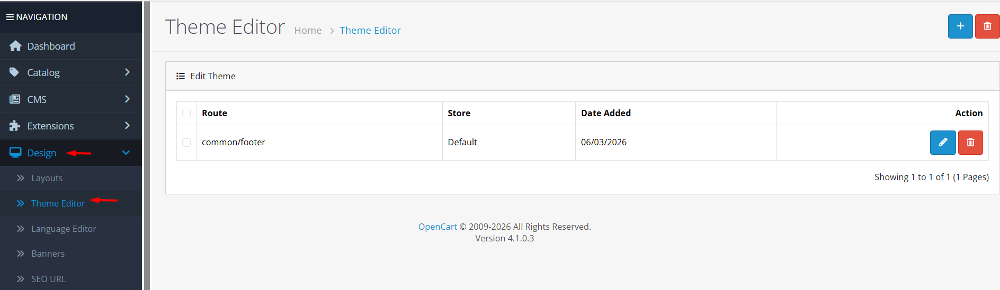
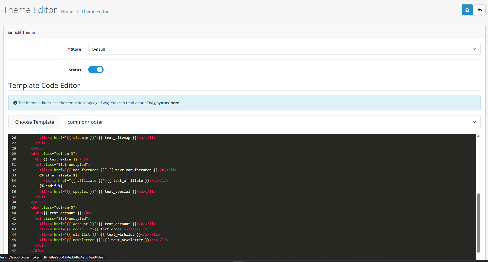

# Theme Editor


**Template Code Editing** 🎨 The Theme Editor allows you to directly edit template files using the Twig templating language. Make live changes to your store's appearance without accessing server files.


## Video Tutorial



_Video: Using the Theme Editor in OpenCart 4_

## Introduction

The Theme Editor in OpenCart 4 provides a web‑based interface for editing template files directly from the admin panel. It supports the Twig templating language and lets you modify HTML structure, add custom code, and customize your store’s appearance without FTP access or direct file system modifications. All changes are stored in the database, allowing you to revert or disable them at any time.

## Theme Override List



The Theme Override list shows all template overrides currently stored in the database. From here you can:

* **Add New**: Create a new template override
* **Edit**: Modify an existing override
* **Delete**: Remove overrides you no longer need
* **Filter**: Search overrides by store, route, or status

Each entry displays:

* **Store**: Which store the override applies to (default or a specific store)
* **Route**: The template file being overridden (e.g., `common/header`, `product/product`)
* **Status**: Whether the override is active (Enabled) or inactive (Disabled)
* **Date Added**: When the override was created
* **Actions**: Edit or delete buttons


**Override vs. Physical File** 📝 Theme Editor overrides are stored in the database, not as physical `.twig` files. The original template file on disk remains untouched, making it safe to experiment.


## Creating / Editing a Theme Override

When you create or edit a theme override, you fill out a form with the following fields:



### Override Configuration

* **Store**: Select which store this override applies to (default or a specific store in multi‑store setups).
* **Status**: Enable or disable the override. Disabled overrides are ignored and the original template is used.
* **Choose Template**: Select the template file you want to override. The list includes:
  * **Default templates**: All `.twig` files from `catalog/view/template/`
  * **Extension templates**: Templates provided by installed extensions (located in `extension/*/catalog/view/template/`)
* **Code**: The Twig template code that will replace the original template content for the selected route.


**Code Editor Features** 🔧 The editor includes syntax highlighting for Twig, HTML, CSS, and JavaScript, line numbers, and a monokai color scheme. It also supports automatic indentation and bracket matching.


## How Theme Overrides Work

OpenCart 4 uses a **template fallback system**:

1. When a page is requested, OpenCart determines which template file should be rendered (e.g., `catalog/view/template/product/product.twig`).
2. Before rendering, the system checks the `theme` database table for an **enabled** override that matches the current **store** and **route**.
3. If a matching override exists and its status is **Enabled**, the override’s `code` is used instead of the file content.
4. If no override exists or the override is **Disabled**, the original template file is rendered.

This mechanism allows you to customize any template without touching the core files, making upgrades safer and reversible.

## Template Structure Overview

OpenCart 4 organizes templates in a hierarchical structure:

| Template Type           | Location                         | Description                  |
| ----------------------- | -------------------------------- | ---------------------------- |
| **Store Templates**     | `catalog/view/template/`         | Frontend store templates     |
| **Admin Templates**     | `admin/view/template/`           | Admin panel templates        |
| **Extension Templates** | `extension/*/view/template/`     | Extension‑specific templates |
| **Theme Templates**     | `catalog/view/theme/*/template/` | Theme‑specific overrides     |


**Note**: The Theme Editor only works with **store templates** (`catalog/view/template/`) and **extension templates**. Admin templates cannot be overridden via the Theme Editor.


## Twig Template Language Basics

OpenCart 4 uses **Twig** as its template engine. Below are the essential concepts you need to edit templates successfully.

<details>

<summary><strong>Variables &#x26; Output</strong></summary>

```twig
{# Display a variable #}
<h1>{{ heading_title }}</h1>
<p>{{ description }}</p>

{# Display with filters #}
<p>{{ text|upper }}</p>
<p>{{ price|number_format(2) }}</p>
```

**Common Variables:**

* `{{ heading_title }}` – Page title
* `{{ description }}` – Page description
* `{{ products }}` – Array of products
* `{{ currency }}` – Currency information

</details>

<details>

<summary><strong>Control Structures</strong></summary>

```twig
{# If statement #}

  <ul>
  
    <li>{{ product.name }}</li>
  
  </ul>

  <p>No products found.</p>


{# For loops #}

  <a href="{{ category.href }}">{{ category.name }}</a>

```

</details>

<details>

<summary><strong>Includes &#x26; Extends</strong></summary>

```twig
{# Include another template #}


{# Extend a base template #}


{# Override blocks #}

  Custom content here

```

</details>

## Best Practices

<details>

<summary><strong>Template Editing Strategy</strong></summary>

**Workflow Guidelines**

**1. Test Locally First** Always test changes on a development or staging store before applying them to a live site.

**2. Make Small, Incremental Changes** Edit one template at a time and verify each change works as expected.

**3. Document Your Changes** Keep notes on which templates you modified, what you changed, and why. This helps when troubleshooting or upgrading.

**4. Use Version Control** Consider using Git for your template overrides, especially if you have many customizations.

**5. Regular Backups** Back up your theme overrides (export the `theme` table) before and after major changes.

</details>

<details>

<summary><strong>Security Considerations</strong></summary>

**Safe Template Editing**

**1. Sanitize User Input** Always escape user‑generated content with Twig’s `|escape` filter to prevent XSS attacks.

**2. Never Embed PHP Code** Twig templates are not meant to contain PHP code. Use Twig’s built‑in functions and filters instead.

**3. Restrict Access** Limit Theme Editor access to trusted administrators only (via User Groups).

**4. Code Review** Review template changes for potential security issues, especially when adding custom JavaScript or form handling.


**Warning**: Avoid using `{{ variable|raw }}` unless you absolutely trust the source of the variable. This can expose your store to cross‑site scripting (XSS) attacks.


</details>

<details>

<summary><strong>Multi‑Store &#x26; Multi‑Language</strong></summary>

**Managing Overrides Across Stores**

**Store‑Specific Overrides** You can create different overrides for each store in a multi‑store setup. Simply select the target store when creating the override.

**Language Considerations** Template overrides are language‑agnostic; they affect the template structure, not the text content. For text changes, use the **Language Editor**.

**Fallback Behavior** If a store does not have a specific override, OpenCart falls back to the default store’s template (or the original file).

</details>

## Common Tasks



#### Creating a New Template Override

1. Navigate to **Design → Theme Editor**.
2. Click **Add New**.
3. Select the **Store** (default or a specific store).
4. Choose a **Template** from the dropdown (default or extension templates).
5. Edit the template code in the editor.
6. Set **Status** to **Enabled**.
7. Click **Save**.


**Quick Load**: When you select a template, the editor automatically loads the current template code. You can modify it or start from scratch.




#### Editing an Existing Override

1. From the Theme Override list, click the **Edit** button next to the override you want to modify.
2. Adjust the **Code** as needed.
3. Toggle **Status** if you want to enable/disable the override.
4. Click **Save**.


**Caution**: Editing an active override will immediately change the live storefront. Consider disabling the override first if you want to test changes in isolation.




#### Disabling / Enabling an Override

1. In the Theme Override list, locate the override.
2. Click **Edit**.
3. Toggle the **Status** switch (On = Enabled, Off = Disabled).
4. Click **Save**.

**Alternative**: You can also delete the override and recreate it later. Disabling is non‑destructive and preserves your code.



#### Reverting to the Original Template

1. Edit the override you want to revert.
2. Delete all code in the editor (or replace it with the original template code).
3. **Or**, simply set **Status** to **Disabled**.
4. Click **Save**.


**No “Revert” Button**: The Theme Editor does not have a built‑in revert button. You must manually restore the original code or disable the override.




## Warnings and Limitations


**Critical Warnings**

* **Database‑Only**: Overrides are stored in the database. If you migrate your store, ensure the `theme` table is included in the backup.
* **No File Locking**: Multiple administrators can edit the same template simultaneously; the last save wins. Coordinate with your team to avoid conflicts.
* **Extension Compatibility**: Overriding extension templates may break when the extension is updated. Review extension changelogs before upgrading.
* **Twig Syntax Errors**: A syntax error in your override can cause a white screen or broken layout. Always test with Debug Mode enabled.
* **Cache Interference**: If template caching is enabled, changes may not appear immediately. Clear the template cache after saving overrides.


## Troubleshooting

<details>

<summary><strong>Template Changes Not Visible</strong></summary>

**Problem: Override saved but storefront shows original template**

**Diagnostic Steps:**

1. **Status Check**: Verify the override is **Enabled**.
2. **Cache Check**: Clear OpenCart’s template cache (**System → Settings → Server**).
3. **Browser Cache**: Hard‑refresh the storefront (Ctrl+F5).
4. **Route Match**: Ensure the override’s **Route** exactly matches the template being rendered.

**Quick Solutions:**

* Disable and re‑enable the override.
* Temporarily disable template caching.
* Check for JavaScript errors in the browser console.

</details>

<details>

<summary><strong>Twig Syntax Errors</strong></summary>

**Problem: White screen or error message after saving**

**Diagnostic Steps:**

1. **Debug Mode**: Enable Debug Mode in **System → Settings → Server** to see detailed error messages.
2. **Syntax Check**: Look for missing ``, ``, or unmatched `{{ }}`.
3. **Variable Names**: Ensure variable names match those provided by the controller.

**Quick Solutions:**

* Revert to the original template code and make smaller changes.
* Use an online Twig validator to check your syntax.

</details>

<details>

<summary><strong>Broken Layout After Changes</strong></summary>

**Problem: Storefront layout is distorted**

**Possible Causes:**

* Missing HTML tags (e.g., unclosed `<div>`).
* Incorrect CSS classes.
* JavaScript conflicts.
* Override code that removes essential markup.

**Solution:**

1. **Compare with Original**: Open the original `.twig` file and compare it with your override.
2. **Browser Inspector**: Use the browser’s developer tools to identify missing or broken elements.
3. **Revert Gradually**: Remove sections of your custom code until the layout stabilizes, then isolate the problematic code.

</details>

<details>

<summary><strong>Multi‑Store Override Issues</strong></summary>

**Problem: Override works on one store but not another**

**Diagnostic Steps:**

1. **Store Selection**: Confirm the override is assigned to the correct store.
2. **Fallback Check**: If a store‑specific override is missing, OpenCart falls back to the default store’s template.
3. **Template Paths**: Verify that the template path exists for that store (some extensions may not be installed on all stores).

**Quick Solutions:**

* Create a separate override for each store that needs customization.
* Use the default store override as a fallback for all stores.

</details>


**Advanced Theme Development** 🛠️ For complex theme modifications beyond simple template overrides:

* Create a full custom theme in `catalog/view/theme/yourtheme/`
* Use template inheritance and overrides at the file level
* Develop custom extensions with their own templates

