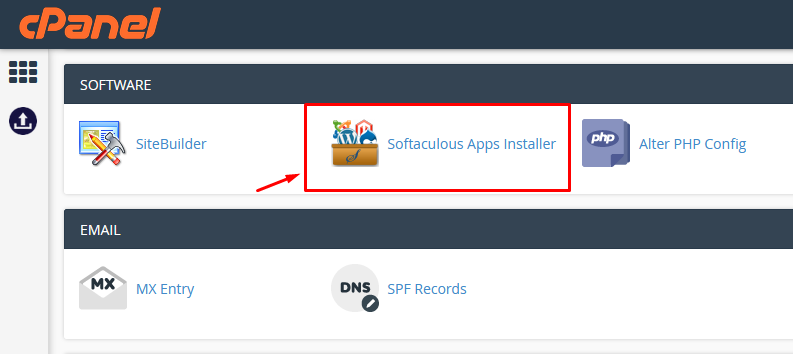
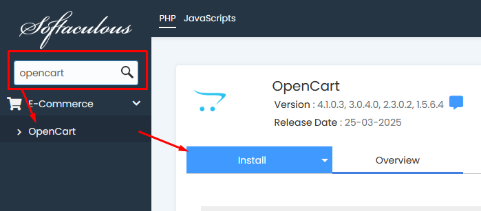
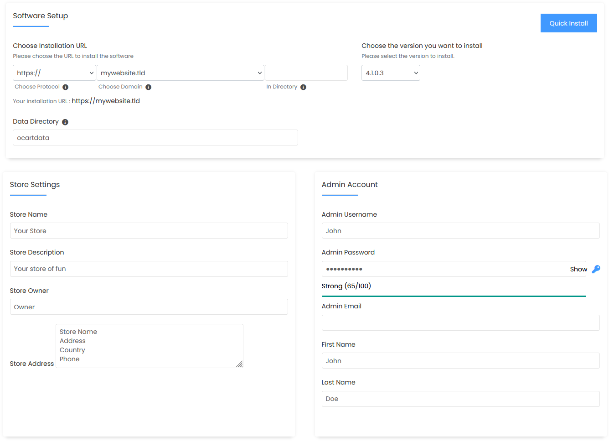
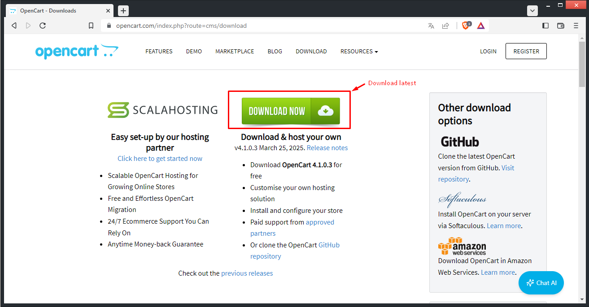
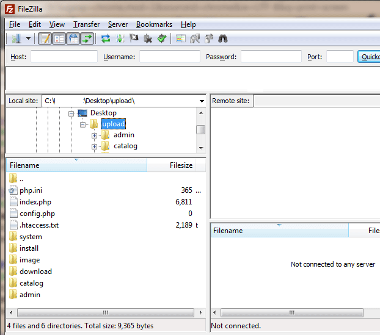
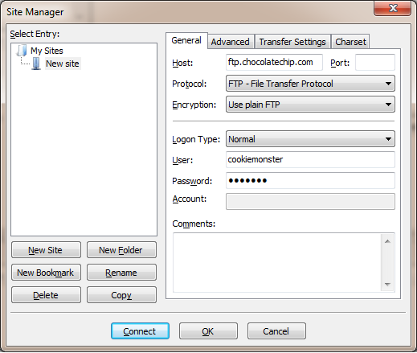
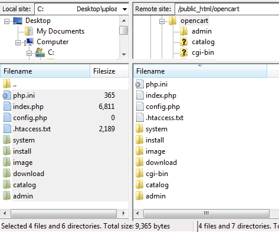
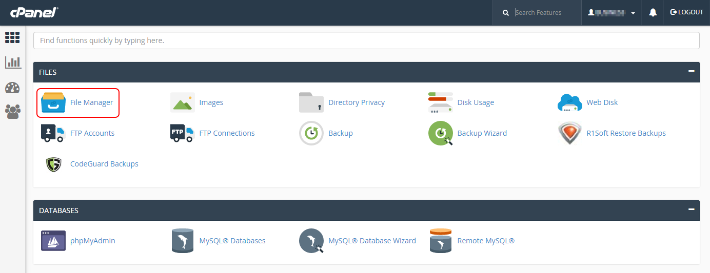

# Installation

This guide will walk you through how to successfully install OpenCart 4.x on your server.

You need hosting that supports PHP8 and database (MySQLi, PDO, or PostgreSQL), if you're looking for an all-in-one solution that includes hosting you can check [OpenCart Cloud Solution](https://www.scalahosting.com/opencart-hosting.html#67c83d5d66431).

***

## Method 1 - Easy installation with Softaculous 


If your host panel have Softaculous, then you can use this method and get your opencart installed in few clicks, if you don't have Softaculous please refer below to [Method 2 - Manual installation](installation.md#manual-installation)


Installing OpenCart with Softaculous is very easy, below is guide based on cPanel but you can follow same procedure if you have Softaculous on other host panels (Plesk, ISP Manager, DirectAdmin, etc.).&#x20;

First log into your host panel and open the _Softaculous Apps Installer_.

<figure><figcaption></figcaption></figure>

In search box search for "OpenCart", click on the corresponding entry, and then click on install button.

<figure><figcaption></figcaption></figure>

You will come to installation screen, you can let most settings by default, just filling the store settings and take care of filling the following:

* Set protocol as https
* Set admin email, username and password (strong password recommended)

<figure><figcaption></figcaption></figure>

Click on "Install", OpenCart will be automatically installed on your server, that's it! your store is ready for use. Once install process done you will see the links to your OpenCart website and your OpenCart admin, you can click on link to admin and log in with the username and password you have just set and start to configure it, now you can jump to [Quickstart](quickstart.md) guide for the next.

***

## Method 2 - Manual installation 


Use manual installation if you don't have cPanel with Softaculous, this can also be used for local installation on computer.


### Downloading and unzipping OpenCart archive

The latest version of OpenCart (v.4.x) can be downloaded from the [OpenCart website](https://www.opencart.com/index.php?route=cms/download) (recommended for end users) or directly from [Github](https://github.com/opencart/opencart) (recommended for developers). The download page also offers access to previous versions of OpenCart. Under the Downloads column, locate the latest 4.x version and press the "Download Now" link. This will download the compressed archive of that version of OpenCart in a zip file. For example, a file named "opencart-4.x.x.x.zip" will be downloaded.

<figure><figcaption></figcaption></figure>

If you don't have a program on your computer that can extract files from a zip file [7-Zip](https://www.7-zip.org/) can be downloaded for free. Unzipping the zip file will uncompress the OpenCart archive so the files can be accessed by a web server.

Extract the zip file so you can access to the extracted folder for next step.

The "upload" folder contains all the files needed to upload OpenCart to a web server. The "license.txt" file contains the license agreement regarding the use of OpenCart on your site. The "readme.text" file provides links to the current install and upgrade instructions on the OpenCart website. When you are ready, you can extract the files from the zip file to a location of your choice on your computer.

### Uploading OpenCart

At this step you should have a web server established and the OpenCart archive extracted. It's possible to use either FTP software or cPanel to upload these uncompressed files to a web server, find below each method:

#### Method 1 - Uploading through FTP client (recommended)

We recommend using Filezilla as your FTP client. Filezilla is a free FTP client that will transfer the OpenCart files to any web server specified. The FileZilla client (not the server) can be downloaded from [https://filezilla-project.org/](https://filezilla-project.org/) and installed onto a computer.

When you open Filezilla you should see your computer's file directory on the left side. The next step is to locate where you saved the uncompressed OpenCart archive and click on the "upload" folder, and the files should appear below it. The directory needs to be left open as we continue. The right hand side is blank at the moment because the target website hasn't been connected to. When connected it will display the file directory of the web server.

<figure><figcaption></figcaption></figure>

Before we continue, we need to make sure that you have the following information about your website:

* the host name
* username
* password

This information can be obtained by contacting your hosting provider.

#### Connecting to the Site Manager

Under the “File” menu, “Site Manager” should be opened in Filezilla. A window will pop up with the General tab open. You should fill in the information gathered above regarding hosting information, and press “Connect”. The right “Remote Site” side will now display the file directory of your website.

<figure><figcaption></figcaption></figure>

#### Uploading OpenCart's files

If you haven't already located the OpenCart upload folder on the left side, you need to do so now and keep it open. In the Remote Site directory (right side), you need to open the folder that the OpenCart shop will be located in. The location of shop varies based on whether the you want the shop to be seen on the main page, a sub-folder, a subdomain, etc. If you want to make OpenCart the main page, you would need to upload files to the root folder of their website.

Be aware that some hosting services require public files to be upload to a public directory, such as public\_html, if they are to be visible on the website. You should check with your hosting provider to see where you can upload public files.

Once the location of the OpenCart shop has been determined, all the content within the “upload” folder on the computer's (left) side of Filezilla must be selected, right-clicked, and uploaded. Uploading all the files might take a few minutes on the FTP client.

If you want the shop to be on the main page, for example www.shopnow.com, you must upload the contents of the “upload” folder, but not the “upload” folder itself. Including the “upload” folder will create a sub-folder, making the shop available only on www.shopnow.com/upload.

After Filezilla finishes uploading the files to the location specified, you should see the same files on both the left side(computer) and on the right side (the website); as seen in the screenshot below:

<figure><figcaption></figcaption></figure>

The Filezilla window should look similar to the above image (minus some directory details). This means that the OpenCart files were successfully transferred the target site. The site now contains the files necessary to setup an OpenCart shop.

#### Method 2 - uploading through cPanel

If your Web Server provider is using cPanel, you can try with this method without FileZilla.

Go to the “Upload” folder and select all the files inside and zip it to a new zip file. Login your cPanel and click the “File Manager” to open a new tag in the browser. Upload the new zip file in your target path, it should be inside the public\_html folder. After that you can right click the zip file and select “Extract" button and done.

<figure><figcaption></figcaption></figure>

### Creating a database for the shop

The next step is to create a database on the MySQL server for OpenCart to store a shop's data on. You should log into the site’s control panel and locate MySQL Databases. Using MySQL Databases, you can create a new database by entering a database name and a username/password to access this database. The user that was just created needs to be added to the database, along with enabling all of the necessary permissions. We will use this database information later when we are configuring OpenCart using the auto-installer.

### Launch the auto-installer

With a new database freshly created, we are now ready to install OpenCart directly onto a website. You should open up a web browser and enter in the web address of where they uploaded OpenCart. If the "install" folder in "upload" was uploaded correctly, you should be automatically greeted by the following page:

This page is the installation page. The following steps will help you complete the installation process for OpenCart.


Important - Rename config-dist.php files


Once all files uploaded, navigate into FTP or file manager to rename the files **/admin/config-dist.php** and **/config-dist.php** to **config.php**.

#### Step 1. License

Read through the license, check "I agree to the license", and press “Continue”.

#### Step 2. Pre-Installation

This step checks the server requirements (PHP 8.0+, MySQL/MariaDB, extensions). Ensure all requirements are green before continuing.

#### Step 3. Configuration

Enter the database details created earlier. Also create an admin username, password, and email for logging into your store's administration area.

#### Step 4. Finished

Once installation is complete, delete the `install` folder for security. You can now visit your shop frontend or log into the admin area.

### Security Recommendations

* The `install` directory should be deleted.
* Move the `storage` folder outside of the web root (OC4 installer provides a one-click option).
* Please type in a new `admin` directory name in the field provided during installation to secure your backend access.
* Use strong admin credentials.

***

## Uninstalling OpenCart

Uninstalling OpenCart involves:

1. Deleting the OpenCart files/folders from your server.
2. Dropping the OpenCart database from MySQL/MariaDB.

Once OpenCart is uninstalled, all product and customer information will be lost unless you have backups.

***

## Support

If there are any issues regarding your store's installation or update, please visit the [Installation, Upgrade, & Config Support](https://forum.opencart.com/) section of the OpenCart community forum.
