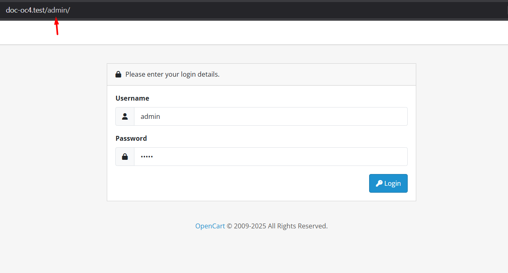
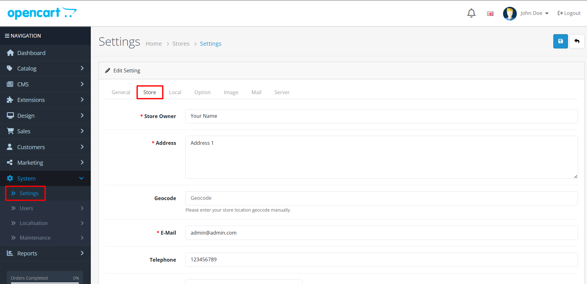
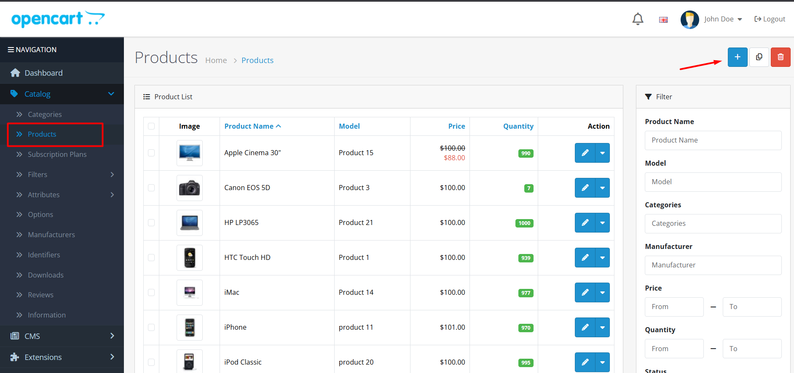
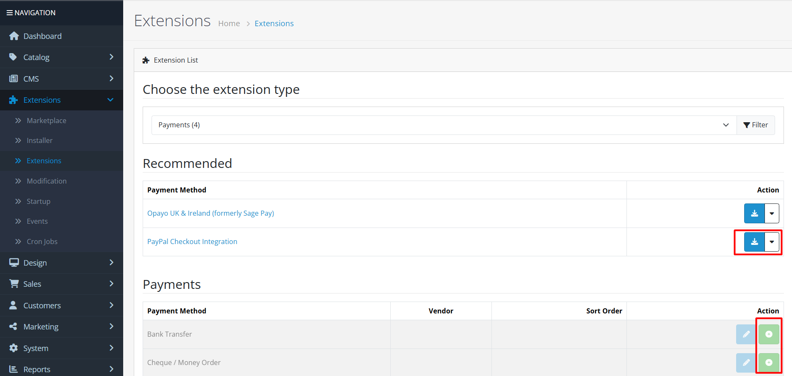
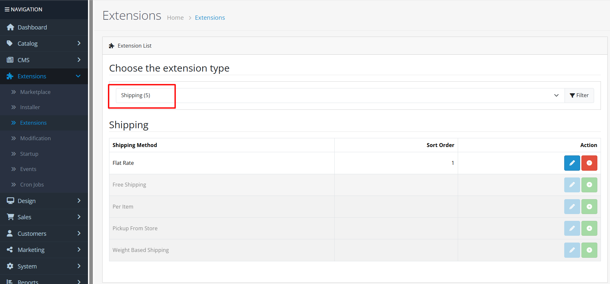

# Quickstart

## Introduction


This guide will help you quickly set up your OpenCart store after installation. Follow the step-by-step instructions below to get your store running in minutes.




#### 1. Access Your Admin Panel


Your admin URL is typically `yourdomain.com/admin` - use the credentials you created during installation.


* Navigate to your admin URL (usually `yourdomain.com/admin`)
* Log in with the credentials created during installation

<figure><figcaption>
Admin login screen - enter your credentials to access the dashboard
</figcaption></figure>



#### 2. Basic Store Configuration


Configure your store's basic information before adding products. This ensures customers see accurate store details.


* Go to **System > Settings**
* Configure your store name, email, and contact information
* Set up your default currency and language

<figure><figcaption>
Store settings page - configure your store name, contact info, and regional settings
</figcaption></figure>



#### 3. Add Your First Product


Start with a simple product to understand the process. You can add more complex products with options and attributes later.


* Go to **Catalog > Products**
* Click "Add New"
* Fill in product details, pricing, and images
* Save and publish

<figure><figcaption>
Product creation form - add product details, pricing, and upload images
</figcaption></figure>



#### 4. Set Up Payment Methods


**Important**: Configure at least one payment method before testing your store. Without payment methods, customers cannot complete purchases.


* Go to **Extensions > Payments**
* Install and configure your preferred payment gateways

<figure><figcaption>
Payment methods page - install and configure payment gateways like PayPal, Stripe, or bank transfer
</figcaption></figure>



#### 5. Configure Shipping


Set up shipping methods that match your business model. Common options include flat rate, weight-based, or free shipping.


* Go to **Extensions > Shipping**
* Set up shipping methods for your products

<figure><figcaption>
Shipping methods page - configure shipping options based on your products and locations
</figcaption></figure>



#### 6. Test Your Store


**Congratulations!** Your store is now ready for testing. Make a test purchase to ensure everything works correctly.


* Visit your store frontend
* Test the shopping cart and checkout process
* Verify that payments and shipping calculations work correctly
* Add product to cart
* Proceed to checkout
* Complete payment process
* Verify order confirmation
* Check admin order management



## Next Steps


**Ready for more?** Now that your store is set up, explore these advanced features to grow your business:


* **Advanced product management** - Learn about product options, attributes, and variations
* **Customer management** - Set up customer groups, custom fields, and loyalty programs
* **Marketing features** - Create coupons, affiliate programs, and email campaigns
* **Reports and analytics** - Track sales performance and customer behavior
* **Extension marketplace** - Discover thousands of extensions to enhance your store


**Pro Tip**: Visit the [Admin Interface documentation](/broken/pages/YZSuC7iUyvAYqG0jc8wb) to master all OpenCart features.

